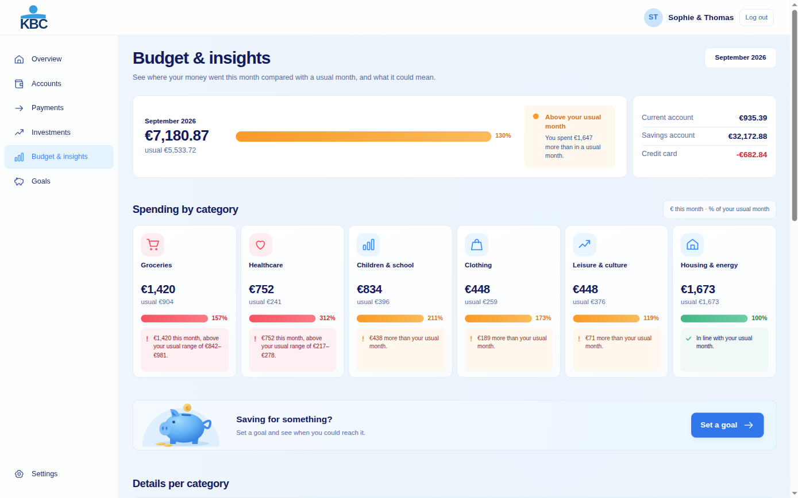
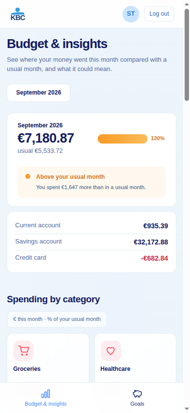

# KBC TIMELINE
## Overview

Most budgeting apps ask you to set limits yourself, and most people understandably give up after a few weeks.

KBC timeline works the other way around. It analyses your past expenses, learns your real spending habits, including seasonal variations and irregular costs, and builds a personalised, adaptive budget for each spending category.

Each month, you can see at a glance whether you are:

- On track
- Ahead of your usual spending
- Heading for an overrun

---

## Screenshots

| Desktop | Phone |
| --- | --- |
|  |  |

---

## How It Works

### 1. It learns your normal

The app studies your transaction history and calculates what a typical month looks like for you in every category, such as:

- Food
- Housing
- Transport
- Hobbies
- Health
- Other recurring expenses

It also adapts to the calendar. For example, it understands that heating costs are usually higher in winter, and that holidays and gifts can cause spending peaks in July and December.

### 2. It shows your month in real time

For each spending category, the app provides a detailed monthly view that compares your current spending with your normal monthly budget.

You can clearly see:

- How much you have already spent
- How much remains
- Whether your current spending pace is ahead of or behind your usual pattern

### 3. It predicts where you will end up

Based on your current spending pace, the app projects your expected end-of-month total for each category.

This allows you to react before the month is over, instead of only noticing the problem afterwards.

### 4. It adapts over time

As your life changes, your budget changes with you.

Whether you move to a new home, start a new job, or your family situation changes, the app updates your budget automatically. You never need to rebuild it manually.

---

## Key Features

- Adaptive budget per category, built from your own spending history
- Detailed monthly view per section, such as food, housing, transport and hobbies
- Real-time comparison with your normal monthly spending
- End-of-month projection for each category
- Smart alerts when you are spending faster than usual
- Seasonality awareness for recurring peaks, such as energy costs, holidays and back-to-school periods

---

## Who It Is For

This app is designed for:

- Anyone who wants to understand their spending without filling in spreadsheets
- Families who need a clear, shared picture of the month
- Seniors who want reassurance and clear warnings
- Students and young adults with irregular income who need to anticipate low points

---

## Requirements

| Tool | Version |
| --- | --- |
| Python | 3.12 or newer |
| Node.js | 20 or newer (with npm) |
| make | any recent version |

Backend packages (installed by `make setup`): FastAPI, Uvicorn, SQLAlchemy, Pydantic, argon2-cffi, pytest.
Frontend packages: React 18, React Router 6, Vite, TypeScript.

---

## Getting Started

```bash
make setup                           # backend venv + frontend packages
DEMO_PASSWORD=demo1234 make seed     # load the demo users with password demo1234
make dev                             # API on :8000, app on http://localhost:5173
```

Or run everything from one server: `make serve`, then open http://localhost:8000.

Run the tests with `make test`.

---

## Demo Accounts

These are fictional users. The logins below assume you seeded with `DEMO_PASSWORD=demo1234` as in Getting Started (without `DEMO_PASSWORD`, `make seed` prints random passwords instead).

| Username | Password | Who | What you'll see |
| --- | --- | --- | --- |
| `desmet` | `demo1234` | Family with three kids | Groceries (€1,420) and healthcare are flagged red in September; back-to-school costs rise but stay orange because they happen every September. |
| `jean` | `demo1234` | Pensioner | Every category is on track, and his saving went from about €200 to €450 a month, with a nudge to connect it to a goal. |
| `lucas` | `demo1234` | Student with an irregular income | Nothing is flagged: the app doesn't raise false alarms. |
